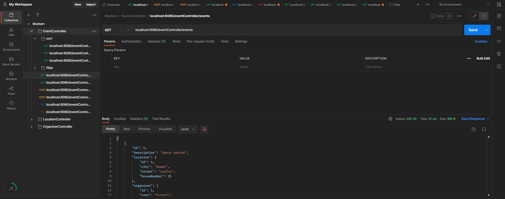

# Event Organizer <a name = "header"></a>


Event Organizer is an application for organize and work with events.<br/> 


## Technologies <a name = "table"></a>


## Features <a name = "table"></a>
- Events
    - Add event
    - Change event
    - Delete event
    - View events list
    - View event by id
    - Filter events by letter
    - Filter events by time
    - Sort events by subject
    - Sort events by time
  - Sort events by organizer surname
- Locations
    - Add location
    - Change location
    - Delete location
    - View locations list
    - View location by id
- Organizers
  - Add organizer
  - Change organizer
  - Delete organizer
  - View organizers list
  - View organizer by id

## ✨ Demo


## Requirements
You will need [Docker](https://docs.docker.com/) (with Compose plugin) installed and running on your machine.

We recommend using Docker Desktop on [macOS](https://docs.docker.com/desktop/install/mac-install/) /
[Windows](https://docs.docker.com/desktop/install/windows-install/) and using [Docker Server]
(https://docs.docker.com/engine/install/#server) distribution for your Linux distribution of choice. 
Use installation instructions provided in the links above.
  
## 🚀 Usage
- Clone project:
  ```sh
  git clone https://github.com/Evgeniy343/TaskModsen
  cd {project-name}
  ```
- Launch
  ```sh
  docker-compose up
  ```

  You will have the opportunity to use this application in Postman because application doesn't have a web interface. 

  In dockerfile generated file .jar and created a database and tables with used file init.sql.

## Troubleshooting
- Docker images built on your computer are not launching correctly and logging something along these lines: 
`Error response from daemon: user declined directory sharing {some_path}/init.sql`

  **Solution**: please go to docker Desktop Settings/Resources/File sharing/ and add a path to your file init.sql.

## Author

* GitHub: [@Zhendos](https://github.com/Evgeniy343)